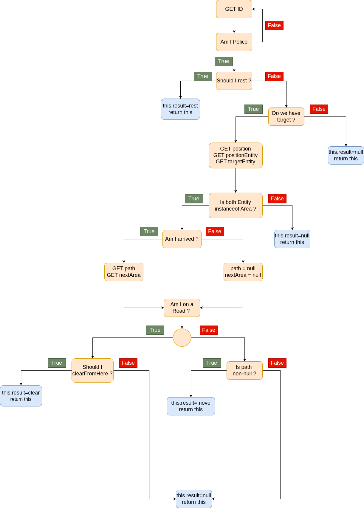
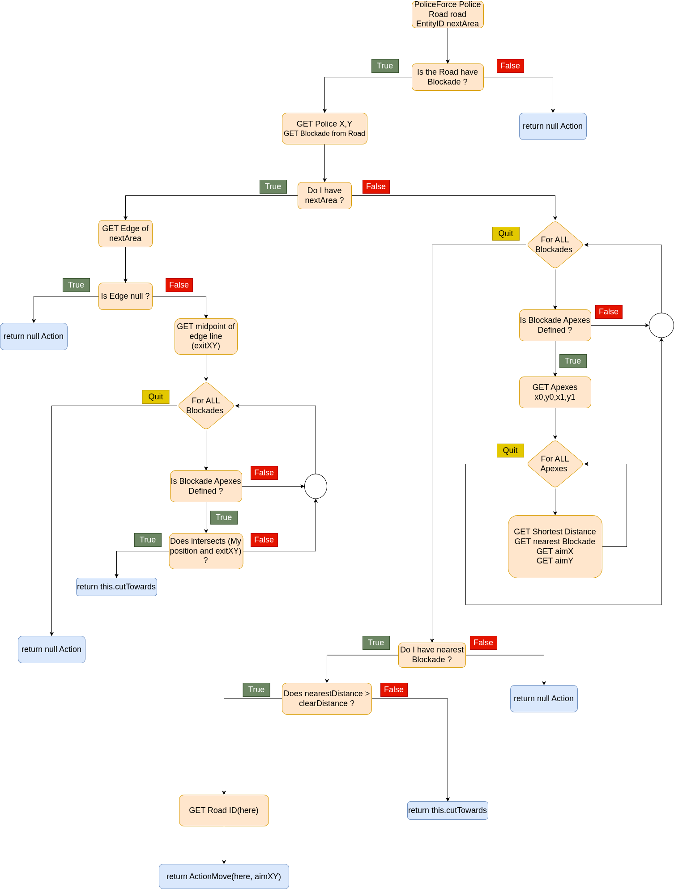
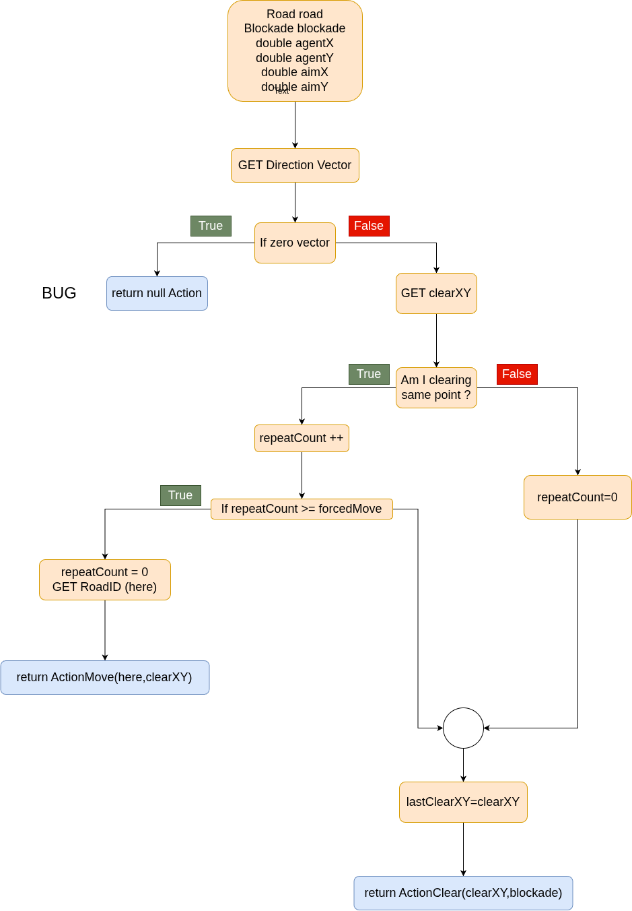

# SampleExtAcionClear

```
public class SampleExtActionClear extends ExtAction
```

## Table of Content

- [SampleExtAcionClear](#sampleextacionclear)
  - [Table of Content](#table-of-content)
  - [Attributes](#attributes)
  - [Constructor](#constructor)
  - [Lifecycle](#lifecycle)
    - [precompute](#precompute)
    - [resume](#resume)
    - [preparate](#preparate)
    - [updateInfo](#updateinfo)
    - [readKernelTime](#readkerneltime)
  - [Action](#action)
    - [calc](#calc)
    - [clearFromHere](#clearfromhere)
    - [cutTowards](#cuttowards)
    - [nextStep](#nextstep)
  - [Geometry](#geometry)
    - [intersects](#intersects)
    - [samePoint](#samepoint)
  - [Resting](#resting)
    - [needRest](#needrest)
    - [calcRest](#calcrest)
  - [Overall Decision Tree](#overall-decision-tree)
  - [clearFromHere Decision Tree](#clearfromhere-decision-tree)
  - [cutTowards](#cuttowards-1)


## Attributes
```java
// Must Defined in every agent
private PathPlanning pathPlanning;
private EntityID target;

// Rest, suggested defined in every agent
private int thresholdRest;
private int kernelTime;

// Agent Specific
private int clearDistance;

// Memory, avoid repeat clean
private int lastClearX;
private int lastClearY;
private int repeatCount;
private int forcedMove;
```


## Constructor
```java
public SampleExtActionClear(
    AgentInfo ai, 
    WorldInfo wi, 
    ScenarioInfo si, 
    ModuleManager moduleManager, 
    DevelopData developData) {

    super(ai, wi, si, moduleManager, developData);

    this.clearDistance = si.getClearRepairDistance();
    this.forcedMove = developData.getInteger(
        "sample_team.module.complex.SampleExtActionClear.forcedMove", 3);
    this.thresholdRest = developData.getInteger(
        "sample_team.module.complex.SampleExtActionClear.rest", 100);

    this.target = null;
    this.kernelTime = -1;
    this.lastClearX = 0;
    this.lastClearY = 0;
    this.repeatCount = 0;

    switch (si.getMode()) {
      case PRECOMPUTATION_PHASE:
      case PRECOMPUTED:
      case NON_PRECOMPUTE:
        this.pathPlanning = moduleManager.getModule(
            "SampleExtActionClear.PathPlanning",
            "adf.impl.module.algorithm.DijkstraPathPlanning");
        break;
    }
  }
```

## Lifecycle

For `precompute`, `resume` and `preparate` only compute **once**. There have a lot of time to compute heavy stuffs like path planning. `updateInfo` and `readKernelTime` is compute for every timestep.

### precompute

```java
@Override
public ExtAction precompute(PrecomputeData precomputeData) {
    super.precompute(precomputeData);
    if (this.getCountPrecompute() >= 2) {
        return this;
    }
    this.pathPlanning.precompute(precomputeData);
    this.readKernelTime();
    return this;
}
```

### resume
```java
@Override
public ExtAction resume(PrecomputeData precomputeData) {
    super.resume(precomputeData);
    if (this.getCountResume() >= 2) {
        return this;
    }
    this.pathPlanning.resume(precomputeData);
    this.readKernelTime();
    return this;
}
```

### preparate
```java
@Override
public ExtAction preparate() {
    super.preparate();
    if (this.getCountPreparate() >= 2) {
        return this;
    }
    this.pathPlanning.preparate();
    this.readKernelTime();
    return this;
}
```

### updateInfo

```java
@Override
public ExtAction updateInfo(MessageManager messageManager) {
    super.updateInfo(messageManager);
    if (this.getCountUpdateInfo() >= 2) {
        return this;
    }
    this.pathPlanning.updateInfo(messageManager);
    return this;
}
```

### readKernelTime

```java
private void readKernelTime() {
    try {
        this.kernelTime = this.scenarioInfo.getKernelTimesteps();
    } catch (NoSuchConfigOptionException e) {
        this.kernelTime = -1;
    }
}
```

## Action

### calc
```java
  @Override
  public ExtAction calc() {
    this.result = null;

    // DEFINE Police
    if (!(this.agentInfo.me() instanceof PoliceForce)) {
      return this;
    }
    PoliceForce police = (PoliceForce) this.agentInfo.me();

    // (1) Survival first. A dead police agent clears nothing.
    if (this.needRest(police)) {
      Action rest = this.calcRest(police);
      if (rest != null) {
        this.result = rest;
        return this;
      }
    }

    if (this.target == null) {
      return this;
    }

    // GET Area (current position and target position)
    EntityID position = police.getPosition();
    StandardEntity positionEntity = this.worldInfo.getEntity(position);
    StandardEntity targetEntity = this.worldInfo.getEntity(this.target);
    if (!(positionEntity instanceof Area) || !(targetEntity instanceof Area)) {
      return this;
    }

    // GET Path, but path is too general, you need nextStep
    List<EntityID> path = null;
    EntityID nextArea = null;
    if (!position.equals(this.target)) {
      path = this.pathPlanning.getResult(position, this.target);
      nextArea = this.nextStep(path, position);
    }

    // (2) Cut through whatever is in the way, here and now.
    if (positionEntity instanceof Road) {
      // clearFromHere is self-defined
      Action clear = this.clearFromHere(police, (Road) positionEntity,nextArea);
      if (clear != null) {
        this.result = clear;
        return this;
      }
    }

    // (3) The way out is open, so drive on.
    if (path != null && !path.isEmpty()) {
      this.result = new ActionMove(path);
    }
    return this;
  }
```

### clearFromHere
```java
  private Action clearFromHere(PoliceForce police, Road road, EntityID nextArea) {
    if (!road.isBlockadesDefined() || road.getBlockades().isEmpty()) {
      return null;
    }

    double agentX = police.getX();
    double agentY = police.getY();
    Collection<Blockade> blockades = this.worldInfo.getBlockades(road);

    if (nextArea != null) {
      // Passing through: only clear what actually blocks the exit we want.
      Edge edge = road.getEdgeTo(nextArea);
      if (edge == null) {
        return null;
      }
      double exitX = (edge.getStartX() + edge.getEndX()) / 2.0;
      double exitY = (edge.getStartY() + edge.getEndY()) / 2.0;
      for (Blockade blockade : blockades) {
        if (blockade == null || !blockade.isApexesDefined()) {
          continue;
        }
        if (this.intersects(agentX, agentY, exitX, exitY, blockade)) {
          return this.cutTowards(road, blockade, agentX, agentY, exitX, exitY);
        }
      }
      return null;
    }

    // Arrived at the target road: sweep it until nothing is left standing.
    Blockade nearest = null;
    double nearestDistance = Double.MAX_VALUE;
    double aimX = 0;
    double aimY = 0;
    for (Blockade blockade : blockades) {
      if (blockade == null || !blockade.isApexesDefined()) {
        continue;
      }
      int[] apexes = blockade.getApexes();
      for (int i = 0; i + 1 < apexes.length; i += 2) {
        double distance = Math.hypot(apexes[i] - agentX, apexes[i + 1] - agentY);
        if (distance < nearestDistance) {
          nearestDistance = distance;
          nearest = blockade;
          aimX = apexes[i];
          aimY = apexes[i + 1];
        }
      }
    }
    if (nearest == null) {
      return null;
    }
    if (nearestDistance > this.clearDistance) {
      // Out of reach: close in on it first.
      List<EntityID> here = new ArrayList<>();
      here.add(road.getID());
      return new ActionMove(here, (int) aimX, (int) aimY);
    }
    return this.cutTowards(road, nearest, agentX, agentY, aimX, aimY);
  }

```

### cutTowards
```java
  private Action cutTowards(Road road, Blockade blockade, double agentX,double agentY, double aimX, double aimY) {
    Vector2D direction = new Point2D(aimX, aimY).minus(new Point2D(agentX, agentY));

    // I FOUND CRITICAL BUGS !!!!
    if (direction.getLength() == 0) {
      return null;
    }
    Vector2D scaled = direction.normalised().scale(this.clearDistance);
    int clearX = (int) (agentX + scaled.getX());
    int clearY = (int) (agentY + scaled.getY());

    if (this.samePoint(this.lastClearX, this.lastClearY, clearX, clearY)) {
      this.repeatCount++;
      if (this.repeatCount >= this.forcedMove) {
        this.repeatCount = 0;
        List<EntityID> here = new ArrayList<>();
        here.add(road.getID());
        return new ActionMove(here, clearX, clearY);
      }
    } 
    else {
      this.repeatCount = 0;
    }
    this.lastClearX = clearX;
    this.lastClearY = clearY;

    return new ActionClear(clearX, clearY, blockade);
  }
```

### nextStep

```java
  private EntityID nextStep(List<EntityID> path, EntityID position) {
    if (path == null || path.isEmpty()) {
      return null;
    }
    int index = path.indexOf(position);
    if (index >= 0) {
      return (index + 1 < path.size()) ? path.get(index + 1) : null;
    }
    return path.get(0);
  }
```

## Geometry

### intersects
```java
private boolean intersects(double fromX, double fromY, double toX, double toY,Blockade blockade) {
    List<Line2D> lines = GeometryTools2D.pointsToLines(GeometryTools2D.vertexArrayToPoints(blockade.getApexes()), true);
    for (Line2D line : lines) {
      Point2D start = line.getOrigin();
      Point2D end = line.getEndPoint();
      if (java.awt.geom.Line2D.linesIntersect(fromX, fromY, toX, toY,
          start.getX(), start.getY(), end.getX(), end.getY())) {
        return true;
      }
    }
    return false;
  }
```

### samePoint
```java
private boolean samePoint(double aX, double aY, double bX, double bY) {
    double tolerance = 1000.0D;
    return Math.abs(aX - bX) < tolerance && Math.abs(aY - bY) < tolerance;
}
```

## Resting

### needRest
```java
private boolean needRest(Human agent) {
    if (!agent.isHPDefined() || !agent.isDamageDefined()) {
        return false;
    }
    int hp = agent.getHP();
    int damage = agent.getDamage();
    if (hp == 0 || damage == 0) {
        return false;
    }
    if (this.kernelTime == -1) {
        this.readKernelTime();
    }
    int survivableCycles = (hp / damage) + ((hp % damage) != 0 ? 1 : 0);
    return damage >= this.thresholdRest
        || (survivableCycles + this.agentInfo.getTime()) < this.kernelTime;
}
```

### calcRest
```java
private Action calcRest(PoliceForce police) {
    EntityID position = police.getPosition();
    Collection<EntityID> refuges = this.worldInfo
        .getEntityIDsOfType(StandardEntityURN.REFUGE);
    if (refuges.isEmpty()) {
        return null;
    }
    if (refuges.contains(position)) {
        return new ActionRest();
    }
    this.pathPlanning.setFrom(position);
    this.pathPlanning.setDestination(refuges);
    List<EntityID> path = this.pathPlanning.calc().getResult();
    if (path != null && !path.isEmpty()) {
        return new ActionMove(path);
    }
    return null;
}
```

## Overall Decision Tree


## clearFromHere Decision Tree


## cutTowards
