# UECS1044 Object-Oriented Application Development
### Group Assignment: RCRS Agent Simulation

| Name | Student ID | Programme |
| -- | -- | -- |
| Carlos Wong | 2303326 | AM |
| Chong Zi Yang | 2401892 | AM |

---

## Table of Contents

1. [Introduction and Problem Statement](#1-introduction-and-problem-statement)
2. [Baseline Reproduction](#2-baseline-reproduction)
3. [Architecture](#3-architecture)
4. [Object-Oriented Design](#4-object-oriented-design)
5. [Implementation](#5-implementation)
6. [Testing, Experiments and Results](#6-testing-experiments-and-results)
7. [Discussion](#7-discussion)
8. [Limitations and Future Work](#8-limitations-and-future-work)
9.  [Conclusion](#9-conclusion)
10. [Individual Contributions](#10-individual-contributions)
11. [References](#11-references)

---

## 1. Introduction and Problem Statement { #1-introduction-and-problem-statement }

### 1.1 Context

RoboCup Rescue Agent Simulation (RCRS) is a disaster-response simulation in which autonomous agents operate in a virtual city after an earthquake. Buildings burn, roads are blocked by debris, and civilians are injured or trapped. Agents perceive only part of the world, communicate over a bandwidth-limited radio channel, and must act within a fixed number of timesteps.

The three platoon roles are interdependent. Ambulance Teams cannot reach victims along blocked roads; Fire Brigades cannot reach fires. **Police Force is therefore a multiplier role**: its own score contribution is indirect, but its failure caps what every other role can achieve.

### 1.2 Scope decision

Our group focused development on the Police Force role. Two reasons:

1. We received a partial Police implementation (`URFPoliceExtActionClear`) from Dr. Mohammad Babrdel Bonab, which gave us a concrete, non-trivial starting point rather than a blank file.
2. Early observation runs showed Police failing in ways that visibly blocked the other two roles, making it the highest-leverage target.

### 1.3 API preparation

Neither `adf-core-java` nor `rcrs-server` ships developer documentation. Before writing code we built our own API reference by reading both repositories and extracting the classes and methods relevant to agent development. We used **markmap** to render the class relationships as an interactive parent–child map rather than working through 100+ files linearly. A large language model (Claude Opus 5) was used as a reading aid during this extraction.

We provide the summarized API reference in `api_ref/` either for `index.html` or all `.md` in `core-docs` and `server-docs`.

API reference also available in our github repo : [Our Github](https://github.com/FlyingCalours/RoboCupRAS/tree/main)

### 1.4 Problems identified

Three concrete failures were observed in baseline runs, each reproducible across maps.

**Issue 1 — Refuge entrances never cleared.** We define a *door* as a road sharing an edge with a refuge. When a door carried a blockade, ambulances could not deliver patients and civilians accumulated outside the refuge and died. No police agent ever cleared a door.

**Issue 2 — Police agents freeze.** Police stopped making progress. The count of frozen agents grew monotonically with timestep.

**Issue 3 — Blocked ambulances ignored.** An ambulance stuck behind a blockade was passed by police agents that continued clearing low-value blockades elsewhere.

---

## 2. Baseline Reproduction { #2-baseline-reproduction }

### 2.1 Environment

| Item | Assignment recommendation | Our environment |
| -- | -- | -- |
| Operating system | Windows 11 | Arch Linux |
| Shell | Git Bash | bash |
| Java | OpenJDK Temurin 21 | Openjdk version "26.0.2.1" 2026-08-18 |
| Root folder | `C:/Users/<username>/Desktop/RoboCupRescue/` | `~/Documents/java/robocup/` |
| Repositories | rcrs-server, adf-core-java, adf-sample-agent-java | same |

### 2.2 Build and run

```bash
# Clone urls
git clone https://github.com/roborescue/rcrs-server.git
git clone https://github.com/roborescue/adf-core-java.git

# Optional to clone our repo, unzip is fine
git clone https://github.com/FlyingCalours/RoboCupRAS.git

# Compile server
cd rcrs-server && ./gradlew completeBuild

cd ..

# Compile ADF core
cd adf-core-java && ./gradlew clean && ./gradlew build

cd ..

# One Tab Run Server
cd rcrs-server/scripts && ./start.sh

# One Tab Run Our Repo, Depends the name, we have 2
cd RoboCupRAS && ./gradlew clean && ./gradlew build && ./launch.sh -all

# Optional : Run Specific Map on Server
cd rcrs-server/scripts && ./start.sh -m ../maps/montreal/map -c ../maps/montreal/config
```

### 2.3 Checkpoint

| Evidence | Status |
| -- | -- |
| `java -version` and `which java` | 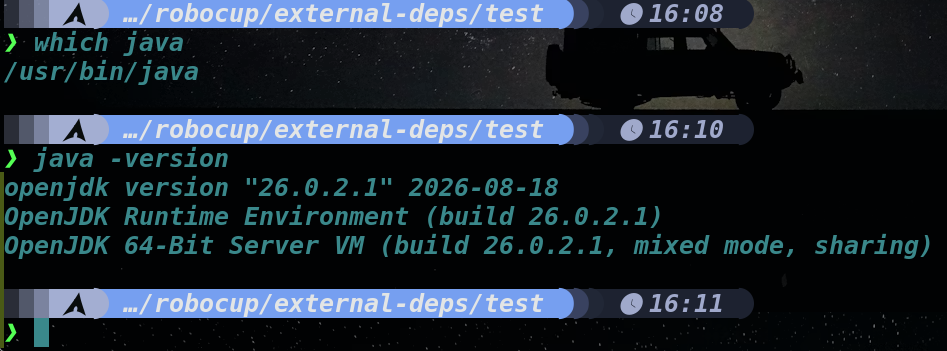 |
| BUILD SUCCESSFUL for all three repositories | 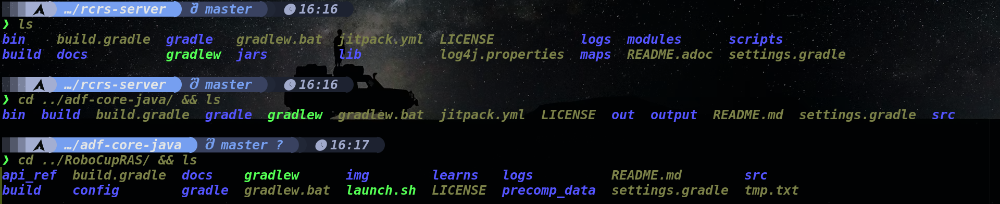 |
| Server GUI and viewer running | 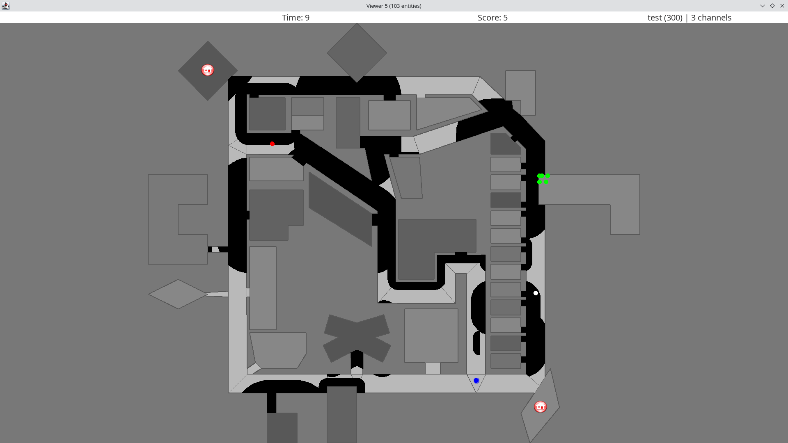 |
| Three platoon agent types connected | 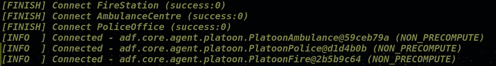 |

---

## 3. Architecture { #3-architecture }

### 3.1 Layers

```
rcrs-server          kernel, simulators, viewer         not modified
      |
adf-core-java        lifecycle, modules, messaging      not modified
      |
adf-sample-agent-java  reference team                   used as baseline
      |
URF (ours)           urf.police                         our contribution
```

We modified neither the server nor the ADF core. All URF code lives under `urf.police`, split into two packages:

| Package | Responsibility |
| -- | -- |
| `...police.improvement` | decision logic — what the agent does |
| `...police.observation` | measurement — what we record about it |

This split is deliberate. Every observation class is a subclass of the corresponding improvement class and overrides only measurement, never a decision. Switching between the two is a configuration change, so an experiment and a competition run execute identical decision code.

### 3.2 Module responsibilities

| Module | Class | Decides |
| -- | -- | -- |
| Target selection | `URFRoadDetector` | *which road is worth going to* |
| Action (clear) | `URFPoliceExtActionClear` | *what to clear within reach, right now* |
| Action (move) | `URFPoliceExtActionMove` | *where to step, and what to do when stepping fails* |

Note the division: the detector chooses a **destination**; the CLEAR module ignores that destination entirely and cuts whatever lies within clear range of the agent's current position. A police agent walking to a refuge door therefore clears every blockade it steps over on the way, at no cost to the sweep.

### 3.3 Workflow diagram

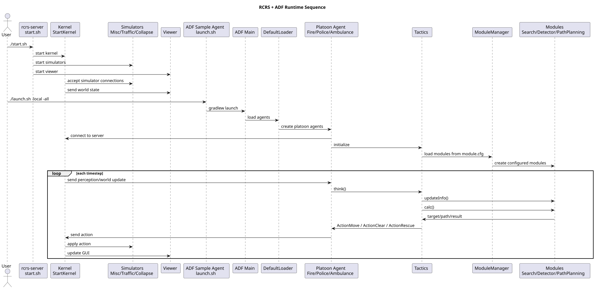

---

## 4. Object-Oriented Design {#4-object-oriented-design}

### 4.1 Class structure

Diagram below show overall parent-child relation between important class , **does not include enum**

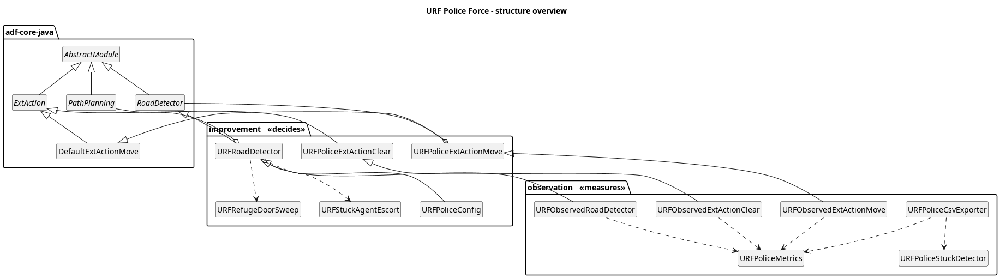

### 4.2 UML class diagram

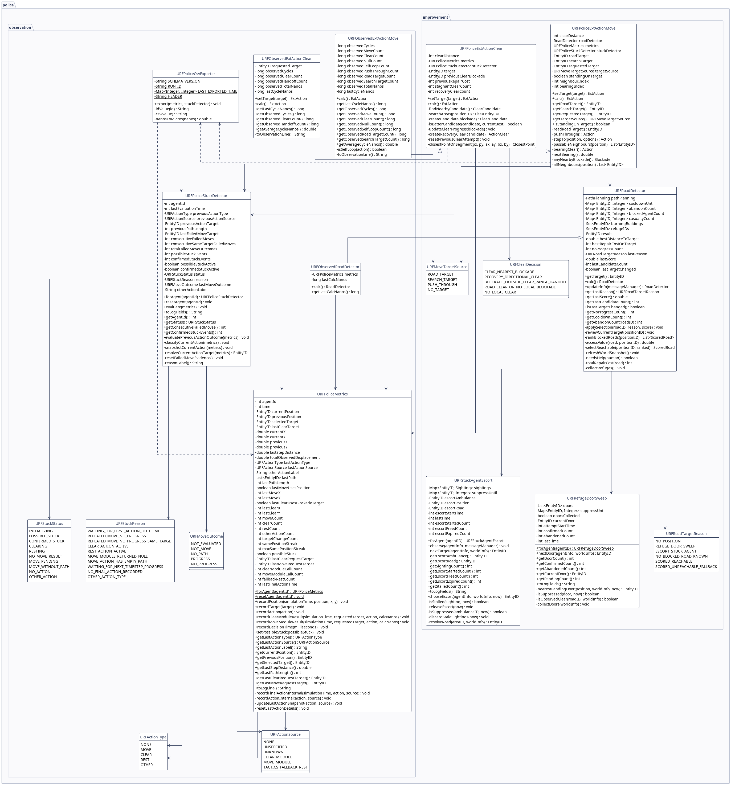

---

## 5. Implementation {#5-implementation}

### 5.1 `URFRoadDetector` — police target selection

The detector answers one question per cycle: which road is worth travelling to? It runs a three-level priority ladder.

| Priority | Source | Rationale |
| -- | -- | -- |
| 1 | refuge door sweep | unobserved refuge entrances, which scoring cannot reach |
| 2 | stuck ambulance escort | a blocked rescue vehicle is costing lives now |
| 3 | access-value scoring | everything else |

Returning `null` is legitimate and means "nothing is worth a trip"; tactics then falls through to the Search module.

#### 5.1.1 Access-value scoring

Each known blocked road is scored on six terms, every term normalised to $[0, 1]$:

$$
\text{value}(R) = w_{\text{ref}}r + w_{\text{agt}}a + w_{\text{fire}}f + w_{\text{cas}}c + w_{\text{cor}}k + w_{\text{here}}p
$$

$$
\text{score}(R) = \frac{\text{value}(R)}{1 + \dfrac{d(P, R)}{D}} \cdot s(R)
$$

| Symbol | Meaning | Weight |
| -- | -- | -- |
| $r$ | road touches a refuge | 6.0 |
| $a$ | other platoon agents standing on it, scaled | 5.0 |
| $f$ | road touches a burning building | 4.0 |
| $c$ | buried or damaged humans on it or adjacent, scaled | 3.0 |
| $k$ | connectivity, $\min(1, \deg(R)/4)$ | 2.0 |
| $p$ | the agent is already standing on it | 3.0 |
| $d(P,R)$ | straight-line distance from the agent | — |
| $D$ | `DISTANCE_SCALE`, 50 000 world units | — |
| $s(R)$ | 1.25 if $R$ was the previous target, else 1.0 | — |

Because every term is bounded by 1, each weight *is* the maximum contribution of its term, so the ordering of the weights is the policy. Retuning means editing six numbers, not editing logic.

The hysteresis factor $s(R)$ is what prevents target thrashing: a challenger must beat the incumbent by more than 25 % to take over.

**Worked example.** Agent at road `R0`. Three blocked roads known:

| Road | $r$ | $a$ | $f$ | $c$ | $k$ | $p$ | value | distance | score |
| -- | -- | -- | -- | -- | -- | -- | -- | -- | -- |
| R1 | 1.0 | 0 | 0 | 0 | 0.75 | 0 | 7.50 | 20 000 | 5.36 |
| R2 | 0 | 0.5 | 1.0 | 0.5 | 1.0 | 0 | 10.00 | 60 000 | 4.55 |
| R0 | 0 | 0 | 0 | 0 | 0.50 | 1.0 | 4.00 | 0 | 4.00 |

R2 is objectively more valuable but three times further away; the distance penalty flips the order and R1 wins. This is intended — a police agent that crosses the map for a marginally better road achieves nothing.

#### 5.1.2 Avoiding repeated low-value clearing

Section 7C of the assignment requires that agents avoid repeatedly clearing low-value blockades. We handle this with **progress tracking and cooldown** rather than a value threshold, because a cheap-looking road may be the only way out.

- Off the target road, progress means the distance shrank by at least 1000 units below the best seen.
- On the target road, distance cannot shrink, so progress means the summed blockade repair cost fell below the best seen.

Eight consecutive cycles without progress puts the road in a 30-cycle cooldown and records an abandonment. `getAbandonCount(EntityID)` exposes which roads defeated the agent.

### 5.2 `URFPoliceExtActionClear` — clearing

The module returns either an `ActionClear` or `null`, never an `ActionMove`. Keeping the return type narrow is what lets each module be ablated independently.

#### 5.2.1 Polygon distance, not centre distance

A blockade is a polygon. Measuring to its centre overestimates distance and makes the agent refuse to clear something it is touching. `createCandidate()` walks each polygon edge and finds the closest point on each segment:

$$
t^{*} = \operatorname{clamp}_{[0,1]}\left(\frac{(P-A)\cdot(B-A)}{\lVert B-A\rVert^{2}}\right), \quad Q = A + t^{*}(B-A), \quad d = \lVert P - Q\rVert
$$


| Symbol | Meaning | Code variable |
|---|---|---|
| $P$ | Agent's position, a point $(p_x, p_y)$ | `px, py` (from `agentX, agentY`) |
| $A$ | First endpoint of one polygon edge | `ax, ay` (from `apexes[i*2]`, `apexes[i*2+1]`) |
| $B$ | Second endpoint of that same edge | `bx, by` (next apex, wrapping via `% pointCount`) |
| $B - A$ | Edge vector — direction and length of the segment | `abX, abY` |
| $P - A$ | Vector from the edge's start to the agent | `(px - ax, py - ay)` |
| $\cdot$ | Dot product: $(u_x,u_y)\cdot(v_x,v_y) = u_xv_x + u_yv_y$ | the `* + *` in the numerator |
| $\lVert \cdot \rVert$ | Euclidean length: $\lVert(u_x,u_y)\rVert = \sqrt{u_x^2+u_y^2}$ | `Math.hypot` |
| $\lVert B-A \rVert^{2}$ | Squared edge length, so no square root is needed | `lengthSquared` |
| $t$ | Fraction along the edge at which the closest point sits: $t=0$ is $A$, $t=1$ is $B$, $t=0.5$ the midpoint | `projection`, before clamping |
| $t^{*}$ | The chosen value — $t$ after clamping | `projection`, after clamping |
| $\operatorname{clamp}_{[0,1]}$ | Force into the interval in the subscript: below $0$ becomes $0$, above $1$ becomes $1$ | `Math.max(0.0, Math.min(1.0, projection))` |
| $Q$ | Closest point on the segment to the agent | `closestX, closestY` |
| $d$ | Distance from the agent to that point | `distance` |


Any point on the infinite line through $A$ and $B$ is :

$$X(t) = A + t(B-A), t \in \mathbb{R}$$

since a point on a line is a start point plus some multiple of the direction.

The clamp is the essential part: without it the "closest point" can land outside the segment and the distance is wrong.

#### 5.2.2 Stagnation and directional recovery

`updateClearProgress()` compares blockade repair cost cycle to cycle. A falling cost proves the command is landing; unchanged cost for `STAGNANT_CLEAR_LIMIT = 3` cycles triggers recovery, which switches from the entity form `ActionClear(blockade)` to the directional form `ActionClear(x, y, blockade)`, aiming a point beyond the blockade boundary but inside the legal clear range. Recovery is still an `ActionClear` — the module solves its own failure rather than escaping into `ActionMove`.

#### 5.2.3 Widening the search beyond the current road (Issue 2 fix)

The original module searched only the agent's current road. This was the root cause of Issue 2:

```
police on road A, blockade on road B covering the passage
  CLEAR:  no blockade near me on road A     -> null
  MOVE:   edge A->B reports passable        -> ActionMove(A, B)
  traffic simulator: refused, blockade in the way
  next cycle: rotate to another exit, refused, ... indefinitely
```

`Edge.isPassable()` means "not a wall" — it says nothing about blockades. So the agent was permanently unable to reach the one action that would free it.

The kernel gates a clear command on **distance**, not on road membership. We therefore replaced `findCurrentRoadCandidate()` with `findNearbyCandidate()` and a helper `searchAreas()`, which collects the agent's area plus every neighbouring area, passable or not. All downstream logic — geometry, ordering, tie-break, stagnation, recovery, observation — is unchanged, and the existing `candidate.distance <= clearDistance` guard still enforces legality.

### 5.3 `URFPoliceExtActionMove` — movement and last-resort recovery

#### 5.3.1 The never-null contract

`ActionRest` is indistinguishable from a crashed agent. MOVE must produce something legal every cycle, so the chain ends with a move-to-self rather than a null: a legal action that produces a log line and lets the stuck detector record "acting but not displacing".


#### 5.3.2 The fallback ladder

| Rung | Condition | Action |
| -- | -- | -- |
| 1 | a neighbour behind a passable edge | `ActionMove(position, next)` |
| 2 | no passable edge, blockade in reach | `ActionClear(x, y, blockade)` on a rotating bearing |
| 3 | no passable edge, no blockade in reach | `ActionMove(position, any neighbour)` |
| 4 | no neighbours at all | `ActionMove(position)` — legal no-op |

Rung 1 is the ideal case where no blockade at the edge, direct move.

Rung 2 is the bug solve of original URFPoliceExtActionClear, forced a clear make no passable became passable. Rotating bearing is the backup in case repeat clearing the same direction. `BEARING_COUNT = 8` and `BEARING_STEP = 3` — coprime — the sequence is 0°, 135°, 270°, 45°, 180°, 315°, 90°, 225°, covering every direction.

Rung 3 is edge cases where no passable edge and no blockade, just give it a try to move toward.

Rung 4 is edge cases also where quite impossible to have a road with no neighbour, just move instead of rest.

### 5.4 `URFRefugeDoorSweep` — Issue 1

#### 5.4.1 Why scoring alone cannot fix it

`URFRoadDetector` gives refuge-adjacent roads the highest weight in the policy, and it still never sent anyone to a door. The reason is fog of war:

```
road.isBlockadesDefined()  ==  "has this agent ever looked at this road?"
```

An unobserved blockade is not in `worldInfo`, so the road is not a candidate, so it scores nothing, so nobody goes, so nobody observes it. The loop closes on itself. Raising the weight to 600 would change nothing. **The only way out is to go and look** — active perception, not better scoring.

#### 5.4.2 Mechanism

A door is a `Road` sharing an edge with a `Refuge`. Doors are collected once, deduplicated and sorted by entity ID so every agent walks them in the same order and runs stay comparable. Each cycle:

| Step | Rule |
| -- | -- |
| 1. Opportunistic confirm | standing on any door that is observed clear → mark confirmed, suppress 50 cycles |
| 2. Give up | current door held ≥ 30 cycles → mark abandoned, suppress 50 cycles |
| 3. Commit | a door is held → return it unchanged |
| 4. Choose | otherwise, nearest non-suppressed door, ties by entity ID |

Step 1 shortens the sweep considerably, since doors often sit on the route between refuges. Step 2 is the failure recovery: without it an agent walks at an unreachable entrance for the rest of the scenario. The 50-cycle recheck exists because doors go stale — a building collapsing at t=90 can drop fresh debris on a door confirmed at t=20. This value can be set to any value for different scenario.

`SWEEP_DEADLINE = 40` stops the sweep issuing doors late in the run. This is a safety valve: worst case the sweep costs `doorCount × 30` cycles, which on a map with many refuges can consume the whole scenario and starve the scoring logic.

### 5.5 `URFStuckAgentEscort` — Issue 3

#### 5.5.1 No new message type was needed

The obvious design is a custom ambulance-side "help me" broadcast. Every police agent already receives the full ambulance roster every cycle:

```
ambulance=24   on 660 of 768 logged cycles
ambulance=0    only at t=1, t=2, t=3 (comms warm-up)
```

24 is the entire ambulance team and the count is flat, meaning **map-wide range**. So the feature is implemented entirely inside the Police role by consuming traffic already on the channel.

#### 5.5.2 The stall signal

`MessageAmbulanceTeam` carries id, position, action, buriedness and HP. The action constants are what make the rule clean:

> An ambulance is stuck when it reports `ACTION_MOVE` from an unchanged position for 3 consecutive cycles.

An ambulance that is resting, rescuing, loading or unloading is stationary *on purpose*; position stagnation alone cannot tell those apart from being blocked. Buried and dead ambulances are excluded — police clearing cannot help either.

When the ambulance reports a **new position**, it is travelling again. That is direct observable evidence the escort worked, so `escortFreed / escortStarted` is a causal measure rather than a correlation with final score. `ESCORT_BUDGET = 20` covers only the failure path.


### 5.6 Observation layer

| Class | Records |
| -- | -- |
| `URFObservedRoadDetector` | area position, physical X/Y, selected target, selection time |
| `URFObservedExtActionClear` | clear-vs-handoff counts, cycle time |
| `URFObservedExtActionMove` | target source, ladder rung reached, never-null assertion, cycle time |
| `URFPoliceMetrics` | per-agent action history, streaks, module call counts |
| `URFPoliceStuckDetector` | displacement-based stuck status and confirmed stuck events |
| `URFPoliceCsvExporter` | one CSV row per agent per timestep |

Each observed class adds only what its parent cannot see about itself.

The exporter writes to `logs/urf/police/police-observation-v2-<runId>-agent-<id>.csv` with schema version `URF_POLICE_OBS_V2` and 44 columns.

---

## 6. Testing, Experiments and Results {#6-testing-experiments-and-results}

### 6.1 Protocol

Three maps, three runs each, identical scenario, server version and time limit. Only the `.cfg` file differs between configurations.

#### 6.1.1 Command for Different Map in RCRS Server
Below is the command in `rcrs-server` for different map.

Montreal :
```bash
./start.sh -m ../maps/montreal/map -c ../maps/montreal/config
```

Paris :
```bash
./start.sh -m ../maps/paris/map -c ../maps/paris/config
```

Berlin :
```bash
./start.sh -m ../maps/berlin/map -c ../maps/berlin/config
```

#### 6.1.2 Command for Different Configuration in Our Repo
Below is the command in our repository for different configuration.

Default Baseline :
```bash
./launch.sh -all
```

Lecturer supplied URF Baseline :
```bash
./launch.sh -mc config/module_baseline_urf.cfg -all
```

Improved URF develop by us :
```bash
./launch.sh -mc config/module_improved_urf.cfg -all
```

### 6.2 Comparing 2 Baseline with Our work

Comparing the lecturer-supplied clearing logic against the ADF default, all else equal.

`URFPoliceExtActionClear`:

| | Montreal | Paris | Berlin |
| -- | -- | -- | -- |
| Run 1 | 14.668 | 11.019 | 9.568 |
| Run 2 | 14.668 | 11.019 | 9.568 |
| Run 3 | 14.668 | 11.019 | 9.568 |

`DefaultExtActionClear`:

| | Montreal | Paris | Berlin |
| -- | -- | -- | -- |
| Run 1 | 16.234 | 11.299 | 9.568 |
| Run 2 | 16.234 | 11.299 | 9.568 |
| Run 3 | 16.234 | 11.299 | 9.568 |

**Full URF (Our) :**

| | Montreal | Paris | Berlin |
| -- | -- | -- | -- |
| Run 1 | 17.425 | 13.541 | 10.098 |
| Run 2 | 17.425 | 13.541 | 10.098 |
| Run 3 | 16.556 | 13.541 | 10.098 |

### 6.3 Evidence figures

| Figure | Content |
| -- | -- |
| 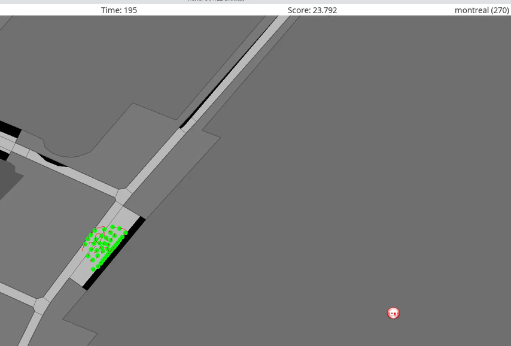 | Issue 1 — civilians accumulated outside a blocked refuge door |
| 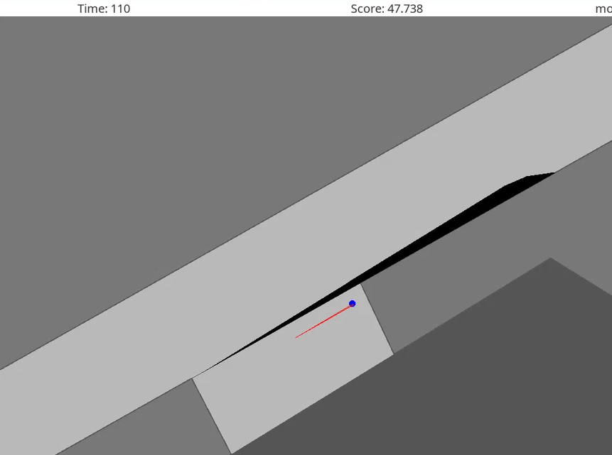 | Issue 2 — police stuck by blockade at one location (URF clear) |
| 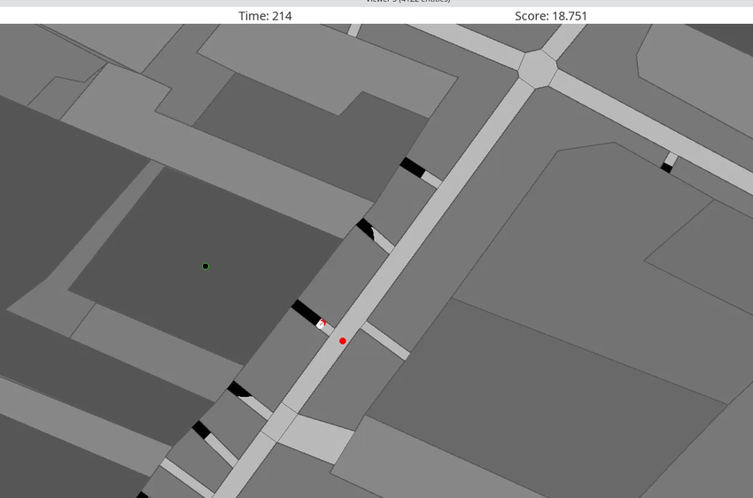 | Issue 3 — police passing a blocked ambulance causing refugee dead |
| 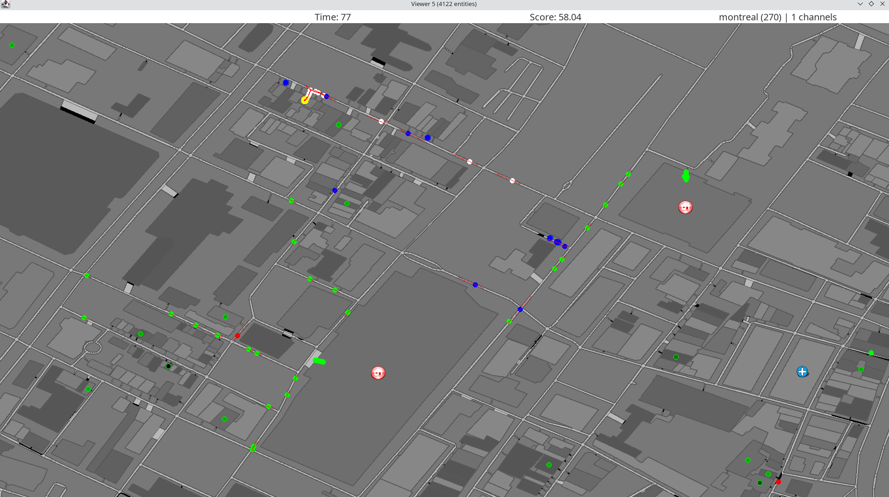 | After fixes — refuge door open, police dispersed |

### 6.4 URF Police Observation CSV — Column Reference

Schema `URF_POLICE_OBS_V2`. One row per police agent per simulation timestep, written by
`URFPoliceCsvExporter.export(...)` at the end of the decision cycle.

File path: `{user.dir}/logs/urf/police/police-observation-v2-{runId}-agent-{agentId}.csv`

"Source file" below means the file that *decides* the value. Almost everything is stored in
`URFPoliceMetrics` and read back out by the exporter, so that staging step is not repeated in every row.

| # | Column | Possible values | Source file | Explanation |
|---|--------|-----------|----------|-----------------|
| 1 | `schemaVersion` | `"URF_POLICE_OBS_V2"` | `URFPoliceCsvExporter` | Constant. Bump it whenever you add or reorder columns, so old and new CSVs are never silently mixed. |
| 2 | `runId` | `"yyyyMMdd-HHmmss"` | `URFPoliceCsvExporter` | Timestamp captured once when the class loads. Every agent in the same JVM run shares it, so it groups a run. It does **not** record which map was used. |
| 3 | `time` | integer ≥ 1 | `URFObservedRoadDetector` (`agentInfo.getTime()`) | Simulation timestep. One row per step; the exporter refuses a duplicate write for the same agent and time. |
| 4 | `agent` | `EntityID` int | `URFPoliceMetrics` (`agentInfo.getID()`) | The police agent's entity id. Also in the filename, so all rows in one file share it. |
| 5 | `position` | `EntityID` int | `URFObservedRoadDetector` | Area (Road or Building) the agent occupies this step. |
| 6 | `x` | double, world units (mm) | `URFObservedRoadDetector` | Physical X. Needed because an agent can move *within* one Area, which `position` alone cannot show. |
| 7 | `y` | double, world units (mm) | `URFObservedRoadDetector` | Physical Y. |
| 8 | `target` | `EntityID` int, or blank | `URFRoadDetector` | Road chosen by the scoring logic (or by the refuge-door sweep / stuck-agent escort override). Blank when no target exists. |
| 9 | `action` | `MOVE` / `CLEAR` / `REST` / `NONE` / an Action class name | `URFPoliceExtActionClear` or `URFPoliceExtActionMove` | The final autonomous action for the step. Values come from `URFActionType`; an unmodelled `Action` subclass prints its class simple name instead of `OTHER`. |
| 10 | `actionSource` | `CLEAR_MODULE` / `MOVE_MODULE` / `TACTICS_FALLBACK_REST` / `UNSPECIFIED` / `UNKNOWN` / `NONE` | same as above | Which decision stage produced the action. Values come from `URFActionSource`. `TACTICS_FALLBACK_REST` means the MOVE module returned null and tactics fell through to rest — a bug signal. |
| 11 | `pathLength` | integer ≥ 0 | `URFPoliceMetrics` (`ActionMove.getPath()`) | Number of areas in the move path. `0` on non-MOVE rows. A MOVE with length ≤ 0 is `MOVE_WITHOUT_PATH`. |
| 12 | `stepDistance` | double ≥ 0 | `URFPoliceMetrics.recordPosition` | Euclidean distance travelled since the previous step, `hypot(dx, dy)`. The stuck detector calls anything below 500.0 "no progress". |
| 13 | `totalDisplacement` | double ≥ 0, monotonic | `URFPoliceMetrics.recordPosition` | Running sum of `stepDistance`. Path length walked, not distance from start. |
| 14 | `moveUsePosition` | `true` / `false` | `URFPoliceMetrics` (`ActionMove.getUsePosition()`) | Whether the move targets a coordinate inside an area rather than just an area sequence. |
| 15 | `moveX` | integer | `URFPoliceMetrics` (`ActionMove.getPosX()`) | Target X of a positional move. `0` when `moveUsePosition` is false. |
| 16 | `moveY` | integer | `URFPoliceMetrics` (`ActionMove.getPosY()`) | Target Y of a positional move. |
| 17 | `clearTarget` | `EntityID` int, or blank | `URFPoliceMetrics` (`ActionClear.getTarget()`) | The **blockade** being cut (not a road), so ids are far higher than area ids. Blank on every non-CLEAR row. |
| 18 | `clearUseTarget` | `true` / `false` | `URFPoliceMetrics` (`ActionClear.getUseOldFunction()`) | `true` = blockade-targeted clear. `false` = directional clear, or no clear this step. |
| 19 | `clearX` | integer | `URFPoliceMetrics` (`ActionClear.getPosX()`) | Aim X. Non-zero only for the 3-argument directional clear used by the recovery path. |
| 20 | `clearY` | integer | `URFPoliceMetrics` (`ActionClear.getPosY()`) | Aim Y, same condition. |
| 21 | `clearRequestTarget` | `EntityID` int, or blank | `URFPoliceExtActionClear` | Road the tactics class handed the CLEAR module this step. **Sticky**: only rewritten when the CLEAR module runs. |
| 22 | `moveRequestTarget` | `EntityID` int, or blank | `URFPoliceExtActionMove` | Target actually handed to the path follower after the road/search/push-through ladder. **Sticky**, and blank when the agent stands on its target and pushes through instead. |
| 23 | `moveCount` | integer ≥ 0, monotonic | `URFPoliceMetrics` | Cumulative MOVE actions. |
| 24 | `clearCount` | integer ≥ 0, monotonic | `URFPoliceMetrics` | Cumulative CLEAR actions. |
| 25 | `restCount` | integer ≥ 0, monotonic | `URFPoliceMetrics` | Cumulative REST actions. Should stay low; a rising value means the agent is idle. |
| 26 | `otherActionCount` | integer ≥ 0, monotonic | `URFPoliceMetrics` | Cumulative actions that are none of the three above. |
| 27 | `targetChangeCount` | integer ≥ 0, monotonic | `URFPoliceMetrics.recordTarget` | How often the road target changed. Rising fast relative to `time` means target thrashing — the agent keeps re-picking before arriving. |
| 28 | `samePositionStreak` | integer ≥ 0 | `URFPoliceMetrics.recordPosition` | Consecutive steps in the same Area. Resets on any area change. Note it counts *area*, so it stays high while the agent shuffles inside one long road. |
| 29 | `maxSamePositionStreak` | integer ≥ 0, monotonic | `URFPoliceMetrics.recordPosition` | High-water mark of the above for the whole run. |
| 30 | `possibleStuck` | `true` / `false` | `URFPoliceStuckDetector` | Detector's coarse flag, written back into metrics. True from 2 consecutive failed moves. |
| 31 | `stuckStatus` | `INITIALIZING` / `POSSIBLE_STUCK` / `CONFIRMED_STUCK` / `CLEARING` / `RESTING` / `NO_MOVE_RESULT` / `MOVE_PENDING` / `MOVE_WITHOUT_PATH` / `NO_ACTION` / `OTHER_ACTION` | `URFPoliceStuckDetector` | Full detector state, from `URFStuckStatus`. The non-stuck values classify normal behaviour rather than signalling a problem. |
| 32 | `failedMoveStreak` | integer ≥ 0 | `URFPoliceStuckDetector` | Consecutive MOVEs that had a path but produced under 500.0 units of travel. Resets on any progress, CLEAR or REST. |
| 33 | `confirmedStuckEvents` | integer ≥ 0, monotonic | `URFPoliceStuckDetector` | Count of *transitions into* confirmed-stuck (4 failed moves **and** 3 against the same target), not steps spent stuck. |
| 34 | `clearModuleCalls` | integer ≥ 0, monotonic | `URFPoliceExtActionClear` | Times the CLEAR module ran. Increments every step, so it tracks `time`. |
| 35 | `clearNullResults` | integer ≥ 0, monotonic | `URFPoliceExtActionClear` | Times CLEAR returned null and handed control to the MOVE module. |
| 36 | `clearActionResults` | integer ≥ 0, monotonic | `URFPoliceExtActionClear` | Times CLEAR produced an `ActionClear`. |
| 37 | `clearMoveResults` | integer ≥ 0, monotonic | `URFPoliceExtActionClear` | Times CLEAR produced an `ActionMove`. Expected to stay 0 — the module is not meant to move. |
| 38 | `clearRestResults` | integer ≥ 0, monotonic | `URFPoliceExtActionClear` | Times CLEAR produced an `ActionRest`. Expected 0. |
| 39 | `moveModuleCalls` | integer ≥ 0, monotonic | `URFPoliceExtActionMove` | Times the MOVE module ran. Equals `clearNullResults`, since MOVE only runs when CLEAR declines. |
| 40 | `moveNullResults` | integer ≥ 0, monotonic | `URFPoliceExtActionMove` | **Must stay 0.** The MOVE module is contractually never-null; a null lets tactics fall through to rest. |
| 41 | `moveActionResults` | integer ≥ 0, monotonic | `URFPoliceExtActionMove` | Times MOVE produced an `ActionMove`. |
| 42 | `moveRestResults` | integer ≥ 0, monotonic | `URFPoliceExtActionMove` | Times MOVE produced an `ActionRest`. |
| 43 | `fallbackRestCount` | integer ≥ 0, monotonic | `URFPoliceExtActionMove` | Increments alongside `moveNullResults`. Counts the observed substitute rest; it does not change the real action. |
| 44 | `clearCalcUs` | double ≥ 0, microseconds | `URFPoliceExtActionClear` | Wall time inside the CLEAR module this step. |
| 45 | `moveCalcUs` | double ≥ 0, microseconds | `URFPoliceExtActionMove` | Wall time inside the MOVE module this step. `0` on steps where MOVE did not run is not emitted — the value is sticky from the last call. |

---

#### Accounting identities

Useful as sanity checks.

```
clearNullResults + clearActionResults          == clearModuleCalls
moveModuleCalls                                == clearNullResults
moveCount + clearCount + restCount + otherActionCount == number of rows
```

#### Data for Most of the Police 

1. Averagely 20% of time spent on clear and 80% spent on move.
2. `moveNullResults`, `restCount`, `otherActionCount` and `fallbackRestCount`and all **0**, they never rest. 
3. `possibleStuck` false throughout, `confirmedStuckEvents` 0, `failedMoveStreak` peaked at 1
4. No positional moves were issued, `moveUsePosition` false and `moveX`/`moveY` 0 everywhere
5. `clearX`/`clearY` 0 everywhere while `clearUseTarget` is true on all clears, means every clear was blockade-targeted and the directional recovery clear never fired.

---

## 7. Discussion {#7-discussion}

**A scoring function cannot prioritise what has never been perceived**, issue 1 and issue 3 can't solve by raising the weight of refuge and the weight of ambulance team. So the easiest method is add an if-else block to manually let police to check both. This should be optimize by communiacation module which will be discuss in sections later.

Bug solving is pain such that we can't identify it immediately and it just failed silently.

Two design decisions :

- We planned a custom ambulance→police message. The needed data was already arriving at 24 messages per cycle, and that the channel was carrying up to 452 `MessageRoad` messages per cycle. We no need custom message.
- Message range is map-wide, which made the feature far more useful than the perception-only version we had designed.

§6 numbers actually show that our improvement work with 17.425 scores in montreal map, slightly higher than default baseline 16.234. However in larger map like paris and berlin, we earn lower score than smaller map like montreal.

---

## 8. Limitations and Future Work {#8-limitations-and-future-work}

### 8.1 Scope

**Only the Police role was improved.** Fire Brigade and Ambulance Team run the unmodified sample modules. We only improve police step by step, optimize the police decision making in order to get higher scores. 

### 8.2 Known technical limitations

| Limitation | Detail |
| -- | -- |
| **Police clump** | All agents run identical logic and often select the same target, so they converge and duplicate work. A distributed assignment — sort police IDs, take `myIndex % doors.size()` — would disperse them with no communication, since every agent knows the full police roster from `worldInfo` at startup. |
| **Oscillating agents are not detected** | The escort detects *frozen* ambulances. An ambulance ping-ponging between two roads resets its stall clock every cycle and is never treated as stuck, despite being equally blocked. Tracking the last 3–4 reported positions would close this. |
| **No inter-police coordination** | Two police agents on the same road both clear the nearest blockade. No target reservation exists. |
| **Blocked-agent term is inferred** | A teammate standing on a blocked road is *assumed* stuck; the agent cannot observe another agent's failed MOVE commands. |
| **Fire brigades not escorted** | `MessageFireBrigade` arrives at 36 per cycle with the same data shape; extending the escort is largely a copy of the observe loop. |
| **Constants are untuned** | `STALL_LIMIT`, `STAGNANT_CLEAR_LIMIT`, `RECOVERY_EXTENSION`, `SWEEP_DEADLINE` were chosen by reasoning, not measurement. |

### 8.3 Future work

1. **Distributed door and target assignment** — to avoid all police having the same target
2. **Target reservation via `MessagePoliceForce`** — the messages already arrive at 22 per cycle and are currently unused.
3. **Machine Learning Algorithm** — the CSV schema was ready to be the dataset in order to train a usable machine learning algorithm that improve the performance for agents.

---

## 9. Conclusion {#9-conclusion}

In conclude, we built modules that make police can do basic clearing and moving without stuck with the codes provided by Dr. Mohammad Babrdel Bonab as the base. 

We faced issue 1 which is the door for refuge never opened. We solve it by commanding every police to navigate to every refuge on the map. It worked, but this can be improve later for communication module.

We faced issue 2 where police agents freeze, this is a small bug occur in the codes provided by lecturer. The issue is police clear blockade on current road only, so we reset it to clear blockade on neighbour road also.

We faced issue 3 which blocked ambulance get ignored by police. There's a free radio where ambulance and fire team keep reporting their position. If police received their position is same as previous, then confirm they stuck and navigate to their location

The result shows our improvement slightly beat the baseline model in 3 different map. Where default baseline beat urf baseline also.

---

## 10. Individual Contributions {#10-individual-contributions}

| Student Name | Student ID | Contribution |
| -- | -- | ------------------ |
| Carlos Wong | 2303326 | Observation module, presentation slide, tester |
| Chong Zi Yang | 2401892 | Improvement module, report, tester |

---

## 11. References {#11-references}

1. RoboCup Rescue Simulation. `rcrs-server`. https://github.com/roborescue/rcrs-server
2. RoboCup Rescue Simulation. `adf-core-java`. https://github.com/roborescue/adf-core-java
3. RoboCup Rescue Simulation. `adf-sample-agent-java`. https://github.com/roborescue/adf-sample-agent-java
4. Bonab, M. B. (2026). *UECS1044/UECS1144 Group Assignment: RCRS Agent Simulation*. Universiti Tunku Abdul Rahman.