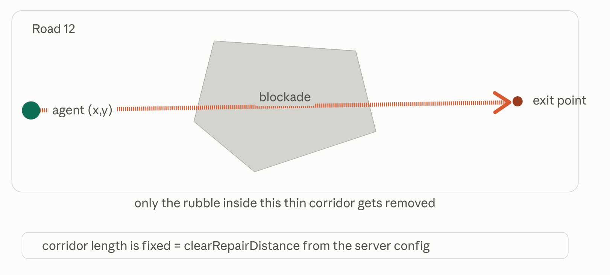
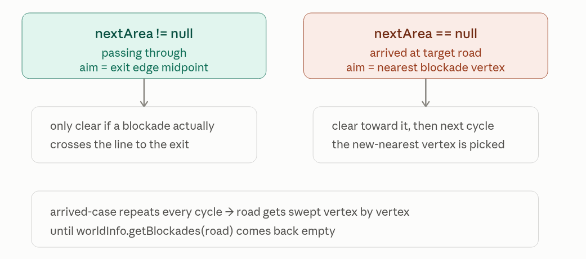
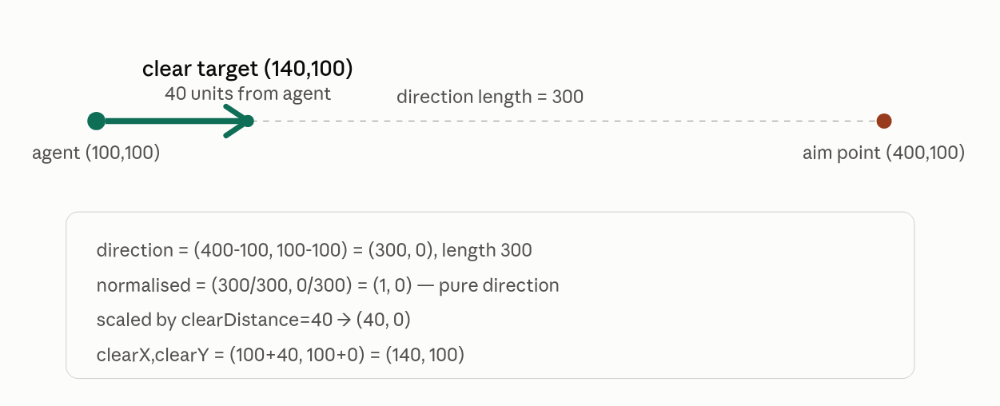

# Hello World of Actual Implementation

This is a note for police to clear blockade, which is the "Hello World" version in robocup.

## How Map is represented internally ?
In real life, you can walk anywhere. But in this simulation, this city is chopped into regions called **Areas**.
A road, a building and a Refuge is Area. Only one agent can sit inside one Area at a time.
Two Area connected only if they share a same physical edge.

The map is actually a graph, **Area** is the nodes and Shared Boundaries is the **edge**. An agent don't have GPS of what is arround, it only know it's Area plus the (x,y) point inside that Area.
The action **moving** means hopping from Area to adjacent Area along the graph, edge by edge.

Hence take note that `pathPlanning.getResult(position,target)` is returning list of Area IDs, sequence of Area to hop, not coordinate. Take note also `nextStep()` grabs `path.get(0)` where `path` is the list of Area IDs mentioned.

## Clearing is not remove blockade, it's cutting a tunnel through it.

`AKClearArea(x,y)` means "starting from where I standing, cut a corridor of fixed length toward point (x,y)"



There is 2 consequences fall straight out of this.

First, the corridor length is fixed, the `clearDistance` is from server config.
If the nearest edge of blockade is farther than corridor length, you need move closer first.
That's the logic of `nearestDistance > this.clearDistance`.

Second, the agent keep aiming the same point every cycle and the corridor still didn't connecting, this meant agent get stuck at an edge.
Hence we have `lastClear X/Y` + `repeatCount` act as the memory that catch the stuck.

## The strict order (rest,clear and move)

Agent can only do one thing per cycle, hence `calc()` need to pick what to do now.


The attached decision tree by police clearly explain the decision logic chain for police.

## Build the calc

Now we can start build the `calc()` which it's where decision made.

Make Sure we are police first
```java
this.result = null;
if (!(this.agentInfo.me() instanceof PoliceForce)) return this;
PoliceForce police = (PoliceForce) this.agentInfo.me();
```

Check should we rest :
```java
if (this.needRest(police)) {
    Action rest = this.calcRest(police);
    if (rest != null) { this.result = rest; return this; }
}
```

There is no destination
```java
if (this.target == null) return this;
```

Check is police and target both are Area
```java
EntityID position = police.getPosition();
StandardEntity positionEntity = this.worldInfo.getEntity(position);
StandardEntity targetEntity = this.worldInfo.getEntity(this.target);
if (!(positionEntity instanceof Area) || !(targetEntity instanceof Area)) return this;
```

Am I arrived ?
```java
List<EntityID> path = null;
EntityID nextArea = null;
if (!position.equals(this.target)) {
    path = this.pathPlanning.getResult(position, this.target);
    nextArea = this.nextStep(path, position);
}
```

If not arrive and something block, clear it. If arrived,sweep it.
```java
if (positionEntity instanceof Road) {
    Action clear = this.clearFromHere(police, (Road) positionEntity, nextArea);
    if (clear != null) { this.result = clear; return this; }
}
```

Path is non-null and non-empty. Then move on.
```java
if (path != null && !path.isEmpty()) {
    this.result = new ActionMove(path);
}
return this;
```



## Build the needRest

The codes 
```java
int survivableCycles = (hp / damage) + ((hp % damage) != 0 ? 1 : 0);
return damage >= this.thresholdRest
    || (survivableCycles + this.agentInfo.getTime()) < this.kernelTime;
```

Use example, if the `hp=100` and `damage=12` for each cycle.

`100 / 12 = 8`, divide and take the `floor(100 divide 12)`

`100 % 12 = 4` while is not 0, then add 1.

Then I get my `survivableCycles=9`.

There are 2 reason why you need rest :

  1. `damage >= this.thresholdRest` means the damage too scary, take care and rest first.

  2. `(survivableCycles + currentTime) < kernelTime`. `kernelTimes` is the timestep, which always 300, the `currentTime` is the timestep for now. This simply means "can I survive until the simulation end?"


## Build the clearFromHere

First, build the decision tree first.
```
Is road have blockade ?
  IF no :
    return null
  IF yes :
    Is the nextArea == null ?
      IF yes :
        scan every apex of every blockade, Is nearest found ?
          IF yes :
            Is within clearDistance ?
              IF yes :
                cutTowards(nearest vertex)
              IF no :
                ActionMove closer first
          IF no :
            return null

      IF no  :
        for each blockade: does the agent-to-exit line cross it?
          If yes :
            cutTowards(exit)
          If no :
            return null
        
```

Check is there any blockade
```java
private Action clearFromHere(PoliceForce police, Road road, EntityID nextArea) {
    if (!road.isBlockadesDefined() || road.getBlockades().isEmpty()) {
        return null;
    }
```

Grab the police(x,y) and Blockade objects(ID, Apexes/Shape needed for geometry).
```java
double agentX = police.getX();
double agentY = police.getY();
Collection<Blockade> blockades = this.worldInfo.getBlockades(road);
```

## Build the cutTowards

Get the direction first
```java
private Action cutTowards(Road road, Blockade blockade, double agentX, double agentY, double aimX, double aimY) {
    Vector2D direction = new Point2D(aimX, aimY).minus(new Point2D(agentX, agentY));
    if (direction.getLength() == 0) {
        return null;
    }
```

Get `clearX` and `clearY` by scale direction with `clearDistance`
```java
Vector2D scaled = direction.normalised().scale(this.clearDistance);
int clearX = (int) (agentX + scaled.getX());
int clearY = (int) (agentY + scaled.getY());
```




